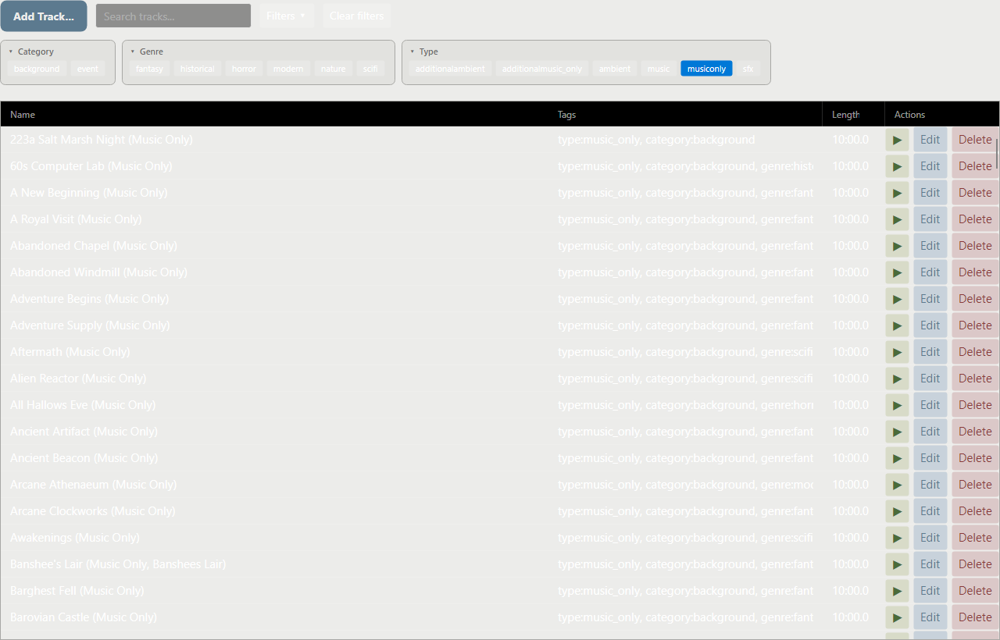
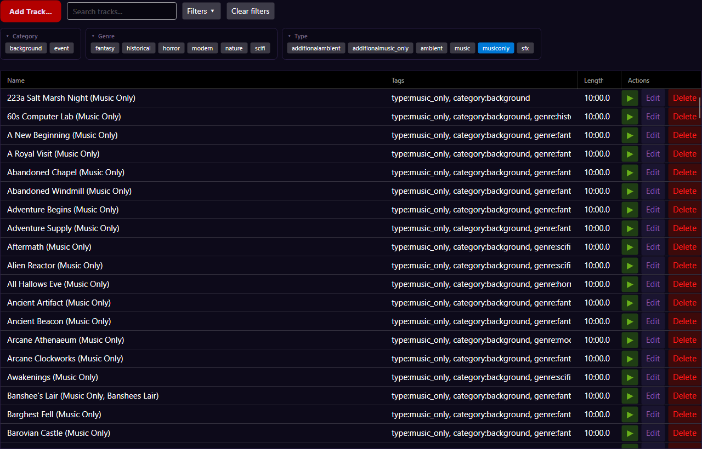

# gmsb-theme-horror-occult

Horror & Occult theme pack for [Game Master Sound Board](https://github.com/DevinSanders/game-master-soundboard).

Two selectable palettes for horror RPG sessions. Each appears as its own entry in the host's theme dropdown.

| Palette           | Vibe                                                        | Primary accent             | Secondary accent              |
|-------------------|-------------------------------------------------------------|-----------------------------|--------------------------------|
| The Sanitarium    | An abandoned, fog-covered hospital / bleak Victorian winter. | Faded ghostly blue #5C7A8F  | Rusted muted crimson #8B3A3A  |
| The Eldritch Void | A vampire's sanctum / cultist's midnight ritual.            | Vibrant blood red #B30000   | Toxic slime green #6BAF1A     |

**The Sanitarium** (fog & ash) — Cold ash gray, muted slate, and sterile off-white surfaces. Faded ghostly blue primary, rusted muted crimson for destructive/stop actions. For Call of Cthulhu daylight investigation, bleak winter dread.

**The Eldritch Void** (velvet & blood) — Abyssal midnight black and deep, sickly indigo surfaces. Vibrant blood-red primary, toxic unearthly slime green for the ritual-complete moments. For Vampire: The Masquerade, midnight cult rituals.

## Preview

| The Sanitarium | The Eldritch Void |
|---|---|
| [](screenshots/Sanitarium.png) | [](screenshots/EldritchVoid.png) |

## Install

**Paid plugin.** The source is open here for reference, but the pre-built
binary is distributed pay-what-you-want on itch.io:

**→ https://dsand64.itch.io/gmsb-theme-horror-occult**

Download the `.zip` from that page and drop it onto **Settings → Plugin
Manager** in Game Master Sound Board. Themes activate live — no restart needed; pick the palette under **Settings → Appearance → Theme**.

## Build

```powershell
dotnet build src/HorrorOccultThemePlugin.csproj
pwsh scripts/package.ps1
# → dist/github.DevinSanders-theme.horror-occult-1.0.0.zip
```

## Plugin manifest

| Field     | Value                            |
|-----------|----------------------------------|
| publisher | `github.DevinSanders`            |
| id        | `theme.horror-occult`            |
| entryDll  | `HorrorOccultThemePlugin.dll`    |
| isTheme   | `true`                           |

## License

Released under the [MIT License](LICENSE). Original colour design for this pack.
